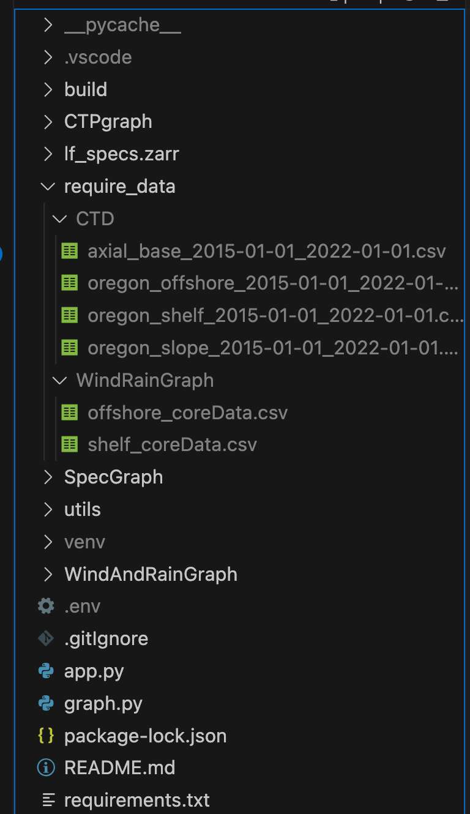

## Description

This repository contains all the <b>back-end</b> source code of the UW Ocean Data Lab data visualization tool. All the front-end codes are already produced within the build file, so it's ready to be used.

If you want to see the detailed React code for the front-end interface, please go to https://github.com/AndrewLiu66/Ocean-lab-frontend

## Development

To download and run this repository, please follow the steps below in your terminal:

1. download the repository

```
$ git clone https://github.com/Ocean-Data-Lab/Website-backend.git
```

2. go to the downloaded repository

```
$ cd Website-backend
```

3. create and run a virtual environment

Try the first way to download a virtual environment. If you have Python 3 installed, this command will work and you can jump to step 4 directly. If you don't have Python 3 installed, try the second way to download the virtual environment.

\***\* first way \*\***

```
$ python3 -m venv venv
$ source ./venv/bin/activate
```

\***\* second way \*\***

```
$ pip install virtualenv
$ virtualenv -p python3 venv
$ source ./venv/bin/activate
```

4. download all the dependencies

```
$ pip install -r requirements.txt
```

5. donwload required data in order to run this repository:
   firstly,create a folder called "require_data" inside the repository, and then go to https://drive.google.com/drive/folders/1htkLFTJEsbtNeJYSkYuOyApsBWVBuTmE ,there are two folders("CTD" and "WindRainGraph") in the drive,go ahead and download these two folders and place them within the "require_data" folder inside this repository, once finish, your repository should look like this:



6. run the project

```
$ python3 app.py
```

6. open a browser and enter the following url

```
$ http://127.0.0.1:5000
```

## Tech Stack

- Backend: Python Flask
- Frontend: React(the build file produced by https://github.com/AndrewLiu66/Ocean-web)
